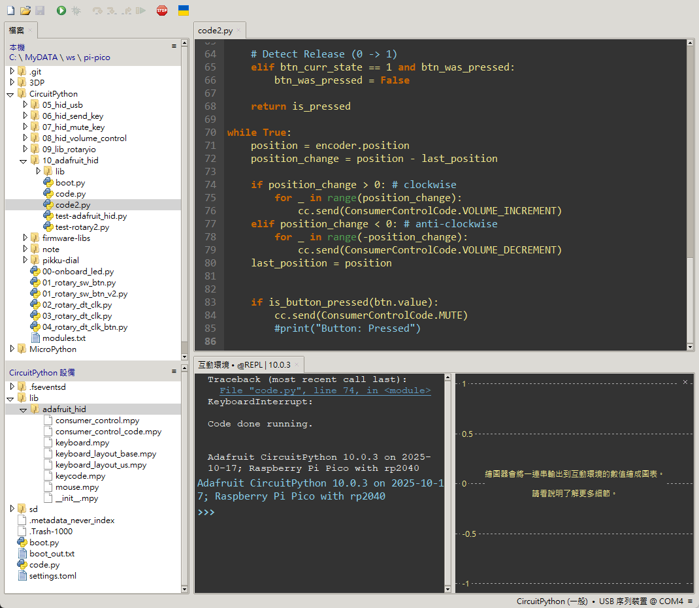

# Pico Volume Knob

## 計畫緣起

我家裡有一個帶旋鈕的機械鍵盤，控制音量非常方便。但是工作用的鍵盤沒有這個功能。

雖然市面上有販售 USB 多媒體外接小鍵盤，但其實我只需要能控制音量而已。

我知道一些微控制器開發板，例如 Atmega32u4、ESP32-S3、RP2040 等，都可以模擬 HID 裝置。

剛好我手邊有幾片買來就吃灰塵到現在的 Raspberry Pi Pico (使用 RP2024)，就拿來玩玩吧。

同時也想在過程中了解如何使用 MicroPython 的開發板。


## 靈感來源

控制音量的裝置本身不算什麼稀奇的專案，網路上有很多類似作品。

但我希望能找一個外觀簡單好看，又不要太複雜的方案。

後來我看到 [Tommi Laukkanen](https://www.codeof.me/author/tommi/) 的 [Pikku Dial](https://www.codeof.me/pikku-dial-multi-mode-dial-controller/) 專案。

我很喜歡 Tommi 的 [3D 外殼設計](https://www.printables.com/model/466564-pikku-dial-controller)，所以決定使用它。

不過程式碼我想自己從頭寫，順便學習 CircuitPython 的開發方式。


## 硬體與接線

* 開發板： Raspberry Pi Pico
* 輸入裝置： KY-040 旋轉編碼器（帶按鈕）


### 接線表

| Device       | Pin Name   | Pico Pin (GPIO) | Physical Pin |
| ------------ | ---------- | --------------- | ------------ |
| KY-040       | GND        | GND             | Pin 38       |
| KY-040       | + (VCC)    | 3V3             | Pin 36       |
| KY-040       | SW         | GP20            | Pin 26       |
| KY-040       | DT         | GP19            | Pin 25       |
| KY-040       | CLK        | GP18            | Pin 24       |
| External LED | Anode(+)   | GP21            | Pin 27       |
| External LED | Cathode(-) | GND             | Any-GND      |


### 旋轉編碼器邏輯

```
 clockwise         anti-clockwise
 =============     ==============
 T | CLK | DT      T | CLK | DT
 --|-----|----     --|-----|----
 0 |  1  | 1       0 |  1  | 1
 1 |  0  | 1       1 |  1  | 0
 2 |  0  | 0       2 |  0  | 0
 3 |  1  | 0       3 |  0  | 1
 4 |  1  | 1       4 |  1  | 1
```

* 當: CLK 1->0
	- DT=0 => anti-clockwise
	- DT=1 => clockwise
* 當: CLK 0->1
	- DT=0 => clockwise
	- DT=1 => anti-clockwise


## 專案目錄說明

MicroPython/ 資料夾存放我最初的測試程式碼。

原本想直接用 MicroPython 實作，但 MicroPython for RP2040 不支援 USB HID，所以改用 CircuitPython 並轉換程式碼。

資料夾的編號順序代表我的學習測試順序。通常我先加入單一硬體寫測試程式，再加入新硬體逐步擴充，編號大的程式碼都是在前面版本的基礎上累積而成。

目前最後的版本在: [CircuitPython/10_adafruit_hid](CircuitPython/10_adafruit_hid)


## 使用方式

1. 將 `boot.py` 上傳到 Pico 頂層 `/`，以設定 HID 裝置。
2. 將 `code2.py` 上傳到 Pico 頂層 `/`，並改名為 `code.py`。
3. 將 [CircuitPython_HID_Keyboard](CircuitPython/10_adafruit_hid/lib) 函示庫整包上傳到 Pico `/lib` 目錄下
4. Pico 上電後，即會依據 `boot.py` 設定為 HID，並執行 `code.py`。



目前韌體功能：

* 旋鈕調整音量
* 按下旋鈕切換靜音

[Tommi 的韌體版本](https://github.com/tlaukkanen/pikku-macropad/tree/main/src-dial)則是按鈕可以切換不同功能（音量、鍵盤方向鍵、滑鼠滾輪），蠻有趣的，可參考。